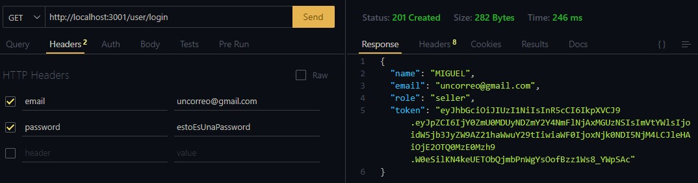
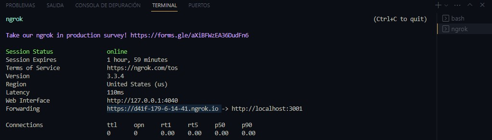

# WinWin Nodejs Coding Challenge

Este desarrollo se genera como respuesta a un reto técnico donde se solicita crear una API funcional que permita realizar operaciones relacionadas con productos, pedidos o cualquier otra entidad relevante para un ecommerce.

## Tabla de Contenidos
- [Sobre el MVP y los requisitos técnicos](#MVP-y-requisitos-técnicos)
- [Instalación](#instalación)
- [Uso](#uso)
- [Estructura del Proyecto](#estructura-del-proyecto)
- [Puntos extras](#Puntos-extras)

## MVP y requisitos técnicos
Considerar 2 entidades (2 atributos c/u). Crear 2 endpoints por cada entidad. Agregar 1 endpoint o entidad adicional para relacionar las entidades. 

Usar Node.js, Express.js, Mongo DB; emplear rutas RESTful, así como medidas de seguridad y accesibilidad controlando el acceso desde dominios externos. Usar ECMAScript modules, incluyendo características de ES6 o posteriores. Mantener el código limpio y legible. 

## Instalación
``` bash
# Instalar dependencias
npm install
#Para iniciar en entorno de desarrollo
npm run dev
#Para iniciar en producción
npm start
```
Debes configurar también la base de datos de Mongo DB con la opción Drivers.


En la ruta **src/configuration/database.js** encontrarás el archivo de configuración de la base de datos. Debes reemplazar la constante DB_URL con la información que te entreguen en la sección Drivers de MongoDB.


Esta es la lista de variables de entorno que necesitarás.
1. **DB_CLUSTER** = _lo obtienes en la sección Drivers de MOngo DB_
2. **DB_USER** = _lo obtienes en la sección Drivers de MOngo DB_
3. **DB_PASSWORD** = _lo obtienes en la sección Drivers de MOngo DB_
4. **PORT** = _es tu elección_
5. **JWT_SECRET** = _es tu elección_
6. **PROD_ACCESS_TOKEN** = _lo obtienes en la configuración de mercado pago_
7. **URL_NGROK** = _en el punto 4.2 lo configuraremos_


## Uso
1. **Registro**: Se requiere un nombre, correo electrónico y una contraseña. El rol es opcional, pero solo si te asignas el **role: seller** podrás guardar productos para poder ofrecerlos. _Ejemplo de la ruta que debes usar:_ 


Cuentas también con la opción de usar los usuarios que ya están creados para hacer las pruebas. [Revísalos en este archivo:](data.json). Atento a los roles.

2. **Login**: Para continuar con las pruebas debes iniciar sesión. Una vez has creado tu usuario o escogido uno del archivo 👆. Atento a los datos que debes mandar por Headers. El login te devolverá un token que se mantendrá activo por 30 minutos. Cada vez que quieras realizar una petición debes enviar el token bajo el schema *Bearer*.  _Ejemplo de la ruta que debes usar:_ 


3. Puedes seguir probando las rutas: **No olvides** que para todas estas rutas debes enviar el token de autorización bajo el **esquema Bearer**, sino no podrás ejecutar las rutas.
```bash
#Puedes consultar los modelos para obtener información a detalle.

#Para consultar qué productos tenemos en stock. Si deseas comprar debes anotar el id del producto que deseas adquirir.
Ruta:   http://localhost:3001/product/inventory
        Method: get
        Authorization: Bearer + token

#Para consultar cuáles son los productos que, como vendedor, has publicado y cuál es el stock. Solo tiene acceso el usuario con rol: seller
Ruta:   http://localhost:3001/product
        Method: get
        Authorization: Bearer + token

#Para publicar nuevos productos. Solo tiene acceso el usuario con rol: seller
Ruta:   http://localhost:3001/product
        Method: post
        Authorization: Bearer + token
        Body: name, price, description, stock

#Para editar productos, se pueden enviar cualquiera de las 4 opciones del body. Solo tiene acceso el usuario con rol: seller
Ruta:   http://localhost:3001/product
        Method: put
        Authorization: Bearer + token
        Body: name, price, description, stock

#Para obtener todos las órdenes que se encuentran a tu nombre
Ruta:   http://localhost:3001/order
        Method: get
        Authorization: Bearer + token

```
4. **Compra**: Para esta última ruta debemos realizar una configuración adicional. 

La compra se configuró con Mercado Pago. Antes de ejecutar la ruta de compra debes generar un túnel con 👉[NGROK](./ngrok.exe)👈  para poder obtener una URL HTTPS, ya que sin eso Mercado Pago no nos dejará realizar el pago. Es la ruta más completa.

* **Paso 1:** Abre el terminal de comandos y coloca lo siguiente: **./ngrok http 3001**, presiona enter y luego copia la dirección https que te dan el **Forwarding**. Ahora coloca la URL en la variable de entorno **URL_NGROK** y estamos listos.


* **Paso 2:** Ahora sí, vamos a comprar, por ello toma en cuenta el stock del producto que deseas adquirir antes de hacer el pedido.

```bash
#La ruta a ejecutar será la siguiente. Todos los precios está en dólares. Recuerda que si tienes rol 'seller' no podrás comprar tus mismos productos.
Ruta:   http://localhost:3001/order
        Method: post
        Authorization: Bearer + token
        Body: productId , quantity

#Al ejecutar esta ruta obtendrás en la respuesta un link. Copialo y pégalo en el navegador para iniciar con el pago. No inicies sesión, paga con la tarjeta que te brindo como medio independiente. Puedes usar estas credenciales para el pago: 

"email": "test_user_1965375891@testuser.com"
"DNI": 12345678
"tarjeta": "Mastercard",
"numero": "5031 7557 3453 0604",
"codigo": "123",
"fecha": "11/25"
```
Luego de haber realizado el pago puedes volver a ejecutar la consulta de los pedidos que se encuentran a nombre del usuario con el que te logueaste. La ruta es _http://localhost:3001/order_

## Estructura del Proyecto
``` bash
- src:
  - configuration:
    - app.js
    - database.js
  - controllers:
    - confirmationMPController.js
    - inventoryGetController.js
    - loginGetController.js
    - orderGetController.js
    - orderPostController.js
    - productGetController.js
    - productPostController.js
    - registerPostController.js
  - handlers:
    - inventoryGetHandler.js
    - loginGetHandler.js
    - orderGetHandler.js
    - orderPostHandler.js
    - productGetHandler.js
    - productPostHandler.js
    - registerPostHandler.js
  - images:
    - login.png
    - Mongo DB configuration.jpg
    - Mongo DB connection.jpg
    - ngrok.jpg
    - register.jpg
  - middlewares:
    - confirmationMPHandler.js
    - registerValidation.js
    - tokenValidation.js
    - validateProduct.js
  - models:
    - order.js
    - product.js
    - user.js
  - routes:
    - indexRouter.js
    - orderRoutes.js
    - productRoutes.js
    - userRoutes.js
  - services: 
    - payOrderMercadoPago.js
- .env
- .gitignore
- data.json
- index.js
- ngrok.exe
- package.json
- pruebaTecnica.md
- readme.md
```

## Puntos Extras:
*   Autenticación para proteger rutas
*   Implementar medidas de seguridad básicas
*   Pruebas unitarias utilizando una biblioteca como Jest
*   Utilizar middleware para gestionar funciones comunes en las rutas
*   Aplica linting para la consistencia y calidad del código.
*   Utilizar servicios externos o de la nube
*   Implementar validaciones para garantizar la integridad de los datos, como validación de entrada y control de errores.
*   Utilizar una convención de mensajes de commit significativa y descriptiva
